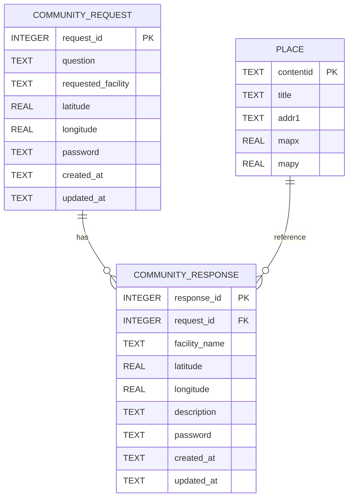

# 🧭 동네레이더 (Dongne Radar)

> **지도에 없는 생활 정보를 이웃들과 함께 만드는 지역 커뮤니티 서비스**

## 📖 프로젝트 소개

기존 지도 서비스에서는 **철봉, 공중 프린터, 식수대, 쉼터**처럼 일상에서
필요한 작은 시설을 찾기 어렵습니다.

**동네레이더**는 이러한 문제를 해결하기 위해 **현지인의 제보를 기반으로
필요한 시설 정보를 공유**하는 지역 커뮤니티 서비스입니다.

사용자는 필요한 시설을 익명으로 요청할 수 있으며, 다른 사용자가 직접
위치를 제보합니다. 축적된 커뮤니티 데이터를 기반으로 챗봇이 자연어로
필요한 시설을 안내합니다.

------------------------------------------------------------------------

# 💡 프로젝트 배경

기존 지도 서비스는 음식점이나 관광지 중심의 정보를 제공하지만 생활
밀착형 시설은 부족합니다.

동네레이더는 지역 주민들이 직접 정보를 등록하고 공유하여 생활 편의시설
정보를 구축하는 것을 목표로 합니다.

------------------------------------------------------------------------

# ✨ 핵심 기능

## 1. 익명 요청 게시판

-   필요한 시설 요청 작성
-   GPS 또는 직접 좌표 입력
-   비밀번호 기반 수정 및 삭제

예)  "탄방동 근처 철봉 있는 곳 아시나요?"

------------------------------------------------------------------------

## 2. 위치 기반 답변

요청 글에 다른 사용자가 답변을 등록할 수 있습니다.

-   시설명 입력
-   후기 작성
-   좌표 직접 입력
-   지도에서 위치 선택

------------------------------------------------------------------------

## 3. 지도 기반 위치 선택

Leaflet 지도를 이용하여 원하는 위치를 클릭하면 좌표가 자동 입력됩니다.

------------------------------------------------------------------------

## 4. 생활시설 지도

커뮤니티에서 제보된 시설을 지도에서 확인할 수 있습니다.

지원 시설 예시

-   철봉
-   화장실
-   ATM
-   벤치
-   공공 와이파이
-   포토존
-   공원
-   주차장

------------------------------------------------------------------------

## 5. 커뮤니티 기반 챗봇

챗봇은 게시판에 등록된 커뮤니티 데이터를 기반으로 답변합니다.

예시) 화장실 어디 있어?

-   주변 화장실 목록
-   거리
-   주소
-   지도 이동

------------------------------------------------------------------------

# 📱 서비스 화면


------------------------------------------------------------------------

# 🛠 기술 스택

## Frontend

-   HTML5
-   CSS3
-   JavaScript
-   Leaflet.js
-   OpenStreetMap

## Backend

-   Python
-   FastAPI
-   Uvicorn
-   SQLAlchemy
-   Pydantic
-   Requests

## Database

-   SQLite

## AI

-   OpenAI API

## External API

-   Open-Meteo API

## Tools

-   Git
-   GitHub
-   VS Code
-   Jupyter Notebook
-   Swagger UI

------------------------------------------------------------------------

# 🏗 시스템 아키텍처

``` text
Frontend (HTML/CSS/JavaScript)
            │
            ▼
       FastAPI Backend
            │
 ┌──────────┴──────────┐
 │                     │
 ▼                     ▼
SQLite            Open-Meteo API
 │
 ▼
Community Data
 │
 ▼
OpenAI Chatbot
```

------------------------------------------------------------------------

# 🗄 DB ERD



------------------------------------------------------------------------

# 📡 API 명세

| Method | Endpoint | 설명 |
|--------|----------|------|
| GET | `/places` | 장소 목록 조회 |
| GET | `/places/bounds` | 지도 영역 조회 |
| GET | `/places/nearest` | 최근접 장소 조회 |
| GET | `/places/{contentid}` | 장소 상세 조회 |
| GET | `/weather/current` | 현재 날씨 조회 |
| GET | `/location-info` | 위치 + 날씨 조회 |
| GET | `/requests` | 요청 목록 조회 |
| GET | `/requests/{id}` | 요청 상세 조회 |
| POST | `/requests` | 요청 등록 |
| DELETE | `/requests/{id}` | 요청 삭제 |
| POST | `/requests/{id}/responses` | 답변 등록 |
| DELETE | `/responses/{id}` | 답변 삭제 |
| GET | `/responses` | 지도용 답변 조회 |
| POST | `/chat` | 챗봇 질문 |
| GET | `/health` | 서버 상태 확인 |

# 📁 프로젝트 구조

``` text
daejeon_radar/
│
├── app/
│   ├── chat/
│   ├── db.py
│   └── models.py
│
├── radar_implement/
│   ├── radar_frontend_v6.html
│   └── radar_frontend_v7.html
│
├── backend_main.py
├── main.py
├── local.db
├── requirements.txt
├── README.md
│
├── daejeon_raidar.ipynb
└── make_response.ipynb
```

## 주요 파일

  파일                     설명
  ------------------------ -----------------
  backend_main.py          FastAPI 서버
  app/chat                 챗봇 모듈
  local.db                 SQLite DB
  radar_frontend_v6.html   메인 프론트엔드
  requirements.txt         라이브러리 목록

------------------------------------------------------------------------

# 🚀 실행 방법

``` bash
git clone "깃 주소"

cd daejeon_radar

pip install -r requirements.txt

uvicorn backend_main:app --reload --port 8000
```

접속

    http://localhost:8000

Swagger

    http://localhost:8000/docs

------------------------------------------------------------------------
